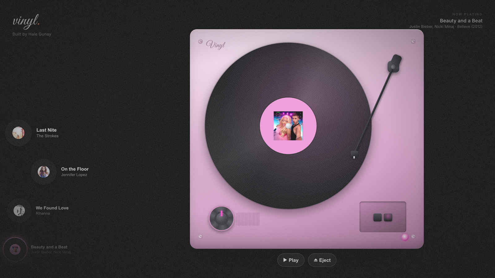

# Vinyl, an Interactive Record Player

A flat, top-down record player built in CSS. Albums live in a scrolling rail on
the left that ripples into a travelling wave as you scroll. Pick one and the
record arcs into the deck, the whole player recolors to the album's cover, the
tonearm swings onto the spinning vinyl, and the room blooms with the album's
color while the track plays.



> **Live demo:** https://hale-vinyl-record-player.netlify.app · Built by **Hale Gunay**

## About the media (please read)

This repository contains source code only. The album artwork and music tracks
are copyrighted by their respective owners and are not included here. They are
excluded via `.gitignore`. This project is a personal, educational portfolio
piece. It is not affiliated with, endorsed by, or licensed from any artist or
label, and the media is not redistributed.

To run it with sound, supply your own audio and covers. See
[Add your own tracks](#add-your-own-tracks).

## Run

```bash
npm install
npm run dev      # http://localhost:5173
```

Other scripts: `npm run build`, `npm run preview`, `npm test`, `npm run lint`,
`npm run format`.

> On a fresh clone the rack is empty and silent until you add media (next
> section). The code runs fine, there is just nothing to play yet.

## Add your own tracks

The `public/audio/` and `public/covers/` folders are git ignored. To populate
the rack:

1. Drop audio files into `public/audio/` and square cover images into
   `public/covers/`.
2. Edit `src/data/records.ts` so each entry points at your files:

   ```ts
   {
     id: 'my-song',
     title: 'Song Title',
     artist: 'Artist',
     album: 'Album (Year)',
     cover: '/covers/my-song.jpg',
     audio: '/audio/my-song.mp3',
     color: '#888888', // fallback only, see below
   }
   ```

3. That is it. The deck color is auto extracted from the cover image at runtime
   (`src/lib/coverColor.ts`), so the `color` field is just a fallback used for
   the first paint.

Use tracks you have the rights to (your own music, royalty free, or Creative
Commons) if you plan to deploy publicly.

## How it works

The interaction is a state machine (`src/store/usePlayerStore.ts`):

```
browsing -> inserting -> seated -> playing -> ejecting -> browsing
```

All transitions go through a single pure `reduce()` function, so illegal moves
are no-ops. You can also switch records on the fly: picking another album while
one is loaded (`reselect`) sends the deck back through insertion with the new
record. The pure logic is unit tested.

- **Record rail** (`src/ui/RecordRail.tsx`): a vertical column of mini vinyl
  discs. On scroll each item is pushed horizontally by a sine of its distance
  from the rail center (plus a scroll driven phase), so the column ripples like a
  travelling wave, with items receding toward the edges. The math is pure and
  tested (`src/lib/wave.ts`).
- **Turntable** (`src/ui/Turntable.tsx`): the big flat top-down deck, built
  entirely in CSS. Plinth, platter, grooved vinyl with the cover as its label, a
  counterweighted tonearm, speed knob, pushbuttons, power LED. It recolors to the
  loaded album via CSS custom properties derived from the cover's dominant color
  (`src/lib/coverColor.ts` plus `src/lib/theme.ts`, unit tested), spins the
  record while audio plays, and swings the tonearm onto the groove on play
  (lifting it on eject).
- **Flying vinyl** (`src/ui/FlyingVinyl.tsx`): a FLIP style flight that arcs the
  record between the rail and the platter along a quadratic Bézier
  (`src/lib/curve.ts`). It drives the state machine, firing insertion and
  ejection complete when it lands, and hands the record off to the platter so the
  motion reads as one continuous object.
- **Background** (`src/ui/Atmosphere.tsx`): GSAP morphed lava blobs (gooey SVG
  filter plus blur), film grain, a vignette, and a TV static canvas. The blobs
  take the current album's color and the field pulses to the live audio level.
- **Playback** (`src/ui/AudioController.tsx` plus `src/lib/audioEngine.ts`): a
  single shared `<audio>` element routed through a Web Audio `AnalyserNode`, so
  the visuals react to the actual sound. A "record placed" sound plays as the
  vinyl drops in, then the track starts. Visible transport (play, pause, eject)
  lives in `src/ui/Controls.tsx`.

## Notes and constraints

- The audio graph is built lazily after the first user gesture
  (`createMediaElementSource` may only run once per element, and browser autoplay
  policy requires a gesture anyway).
- Respects `prefers-reduced-motion` by skipping the rail wave, the flight arc,
  the record spin, and the blob drift.
- Pure CSS and DOM, no WebGL. The bundle is about 80 kB gzip.
- Adapts to narrow screens by stacking the rail above the deck.

## Tech

React with TypeScript, Vite, Zustand (state), GSAP (background), the Web Audio
API (playback and analysis), and Vitest (unit tests). No paid services, since
everything runs in the browser.

## License

Source code is [MIT licensed](LICENSE). The license covers the code only, not
the album artwork or audio used in the demo, which belong to their respective
owners.
